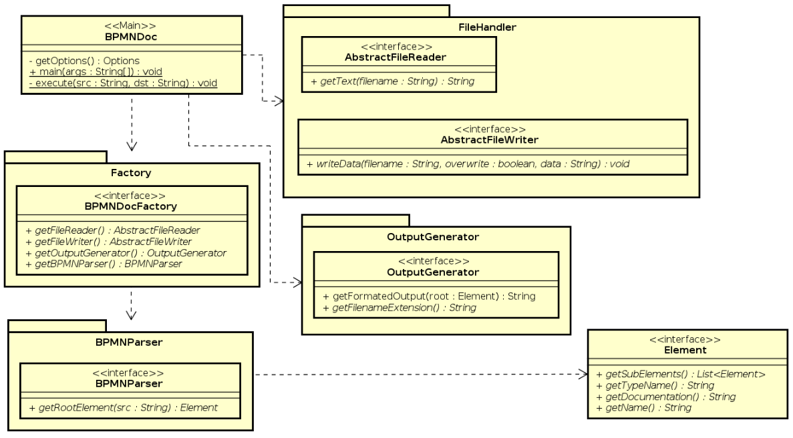
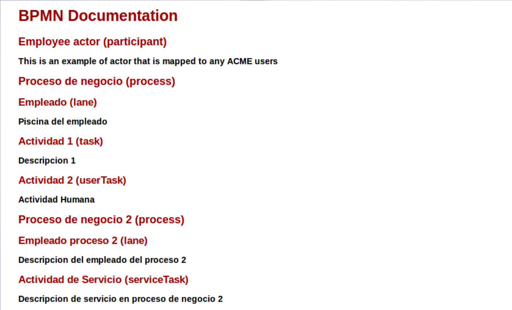

BPMN Documentation Tool
=======================

La herramienta BPMNDoc es una herramienta que ayuda en la generación de documentación para diagramas 
de procesos de negocio hechos en el software de Bonita de [Bonitasoft](https://www.bonitasoft.com/), donde 
la documentación se realiza de forma similar a la conocida documentación de Java que se produce con la
herramienta *Javadoc*.

## Formato XML de BPMN
Se parte por identificar los componentes de un archivo XML generado por Bonita, de donde, basándose en la 
estructura de árbol que este posee, se identifican ciertos aspectos.

El primer aspecto a tomar en cuenta es que toda la definición de la semántica de los diagramas de BPMN están
bajo la etiqueta de *raíz* que es la primera etiqueta que se encuentra dentro del archivo, por donde se parte
el resto de la estructura de árbol, esta es la etiqueta `<model:definitions>`.

En el caso de este formato XML de Bonita, se tiene que todas las definiciones semánticas del modelo en BPMN
dentro de las etiquetas que contienen el texto `model:`. Cada etiqueta siempre contiene un atributo `id`.

**Inicio del XML**

```xml
<?xml version="1.0" encoding="UTF-8"?>
<model:definitions xmlns:xsi="http://www.w3.org/2001/XMLSchema-instance" xmlns:bonitaConnector="http://www.bonitasoft.org/studio/connector/definition/6.0" xmlns:dc="http://www.omg.org/spec/DD/20100524/DC" xmlns:di="http://www.omg.org/spec/BPMN/20100524/DI" xmlns:di_1="http://www.omg.org/spec/DD/20100524/DI" xmlns:java="http://jcp.org/en/jsr/detail?id=270" xmlns:model="http://www.omg.org/spec/BPMN/20100524/MODEL" xsi:schemaLocation="schemaLocation http://www.omg.org/spec/BPMN/20100524/MODEL schemas/BPMN20.xsd" exporter="BonitaSoft" exporterVersion="7.6.0" expressionLanguage="http://groovy.apache.org/" targetNamespace="http://bonitasoft.com/_VglSIBAREeiptuDNTChZDg">
```

**Colaboración de participantes (`collaboration`)**

En esta etiqueta se definen los nombres de los procesos (con sus referencias) y de los actores que están 
presentes en el proceso

```xml
<model:collaboration id="_VglSIBAREeiptuDNTChZDg">
	<model:participant id="_ps3ooBA6EeiptuDNTChZDg" name="Proceso de negocio" processRef="_VglSIRAREeiptuDNTChZDg"/>
	<model:participant id="_VglSRRAREeiptuDNTChZDg" name="Employee actor">
		<model:documentation>This is an example of actor that is mapped to any ACME users</model:documentation>
	</model:participant>
	<model:participant id="_ps76EBA6EeiptuDNTChZDg" name="Proceso de negocio 2" processRef="_DQ6VgBA5EeiptuDNTChZDg"/>
</model:collaboration>
```

**Proceso (`process`)**

En esta etiqueta se especifican todos los elementos que componen el proceso junto con sus relaciones. entre esos
elementos se encuentran los *lanes* (las pistas), donde se especifican los elementos que están dentro de la
misma.

```xml
<model:laneSet id="Proceso de negocio_laneSet">
	<model:lane id="_VglSIhAREeiptuDNTChZDg" name="Empleado">
        <model:documentation>Piscina del empleado</model:documentation>
        <model:flowNodeRef>_VglSIxAREeiptuDNTChZDg</model:flowNodeRef>
        <model:flowNodeRef>_YBxcgBAREeiptuDNTChZDg</model:flowNodeRef>
        <model:flowNodeRef>_ay-_4BAREeiptuDNTChZDg</model:flowNodeRef>
        <model:flowNodeRef>_d1txEBAREeiptuDNTChZDg</model:flowNodeRef>
    </model:lane>
</model:laneSet>
```

Ahora por cada elemento que se encuentre después de estos definidos son los elementos que fueron definidos en
los *lanes*.

```xml
    <model:startEvent id="_VglSIxAREeiptuDNTChZDg" name="Inicio"/>
    <model:endEvent id="_YBxcgBAREeiptuDNTChZDg" name="Fin"/>
    <model:task id="_ay-_4BAREeiptuDNTChZDg" name="Actividad 1">
    	<model:documentation>Descripcion 1</model:documentation>
    </model:task>
    <model:userTask id="_d1txEBAREeiptuDNTChZDg" name="Actividad 2">
    	<model:documentation>Actividad Humana</model:documentation>
    </model:userTask>
    <model:sequenceFlow id="_VglSQhAREeiptuDNTChZDg" name="" sourceRef="_VglSIxAREeiptuDNTChZDg" targetRef="_ay-_4BAREeiptuDNTChZDg"/>
    <model:sequenceFlow id="_ckA4oBAREeiptuDNTChZDg" name="" sourceRef="_ay-_4BAREeiptuDNTChZDg" targetRef="_d1txEBAREeiptuDNTChZDg"/>
    <model:sequenceFlow id="_f3IPMBAREeiptuDNTChZDg" name="" sourceRef="_d1txEBAREeiptuDNTChZDg" targetRef="_YBxcgBAREeiptuDNTChZDg"/>
</model:process>
```

donde respectivamente se tienen los elementos (no necesariamente en el orden del proceso), entonces, para este
ejemplo se tienen:

Etiqueta | Elemento
-------- | --------
`startEvent` | Evento de inicio
`endEvent` | Evento de terminación
`task` | Actividad abstracta
`userTask` | Actividad de usuario (humana)

Estos son algunos de los elementos que se pueden encontrar, sin embargo la lista de elementos posibles que
se pueden tener dentro los modelos es extensa.

El elemento `flowNodeRef` son la relaciones entre los objetos, estos se relacionan por medio de sus 
atributos de `id` los cuales tienen que ser únicos.

Ahora bien, considerando que la lista de posibles elementos que se pueden encontrar dentro del modelo es extensa
y no hay forma de distinguirlos como un elemento que esta dentro del diagrama (a menos que se tenga la lista 
completa de los elementos de antemano), la forma de generar la documentación en el caso de esta herramienta es 
el uso de la etiqueta `documentation`, la cual provee la documentación del elemento donde se encuentra, y 
esta siempre se encuentra un nivel inferior respecto al elemento que esta documentando.

### Método de generación de la documentación
La documentación que se genera es únicamente en base a los elementos que poseen la etiqueta `documentation`
dentro de su árbol interno, por lo tanto, el determinar si un elemento será incluido dentro de la documentación
es teniendo esa etiqueta definida.

## Diseño del programa


Descripción de los paquetes, clases e interfaces que componen el diagrama:

* Clase __BPMNDoc__ : En este diagrama se tiene una clase *main* donde se realiza la ejecución de los demás componentes y donde se lleva a cabo la lógica general de la aplicación.
* Interfaz __Element__ : Es la representación de las etiquetas del XML, posee los atributos necesarios para construir la documentación, y tiene los sub-elementos que se encuentran en la parte inferior del árbol, en donde siempre, las hojas del árbol (los elementos finales) contienen documentación definida.
* Paquete __BPMNParser__ : Clases encargadas de realizar la interpretación de la estructura del XML del BPMN generado por Bonita
  * Interfaz __BPMNParser__ : Provee la funcionalidad de retornar el elemento raíz del XML por medio de la abstracción dada por la interfaz `Element`, este procesa la información del árbol y construye los objetos `Element` de forma que mantengan la misma jerarquía que el documento XML original
* Paquete __OutputGenerator__ : Clases encargadas de la generación de la salida a ser escrita, en el caso de la aplicación, la salida es HTML, sin embargo permite la implementación de cualquier otro formato que sea con información de texto
  * Interfaz __OutputGenerator__ : Provee la funcionalidad de retornar la salida en texto plano del tipo de salida que se quiere dar, se basa en el elemento *raíz* (de tipo `Element`) para la construcción de la misma.
* Paquete __FileHandler__ : Clases encargadas de la interacción con los elementos I/O de donde se lee o se escribe la información, y proveen un nivel de abstracción sencillo para el manejo de los archivos (o entrada estándar si se desea)
  * Interfaz __AbstractFileReader__ : Provee la funcionalidad de leer archivos, donde este retorna en texto plano sus contenidos
  * Interfaz __AbstractFileWriter__ : Provee la funcionalidad de escribir archivos con la información en texto plano que es suministrada por un OutputGenerator

* Paquete __Factory__ : Realiza la construcción de los objetos correspondientes a un propósito en particular, es decir, provee la capacidad de extensibilidad.

La característica que da valor al diseño es el principio de *alta cohesión, bajo acoplamiento*, donde si es 
requerido, se puede cambiar fácilmente el comportamiento de la aplicación, donde se puede optar (en este caso)
el cambio de la forma en que se realiza la interpretación del XML de entrada, se puede cambiar para que se de
la salida en formato JSON o PDF en vez de HTML, se puede optar por cambiar los dispositivos de I/O de forma que
en vez que se use un archivo como salida se pueda dar la salida por otro medio, tal como la salida estándar, 
etc.

## Compilación de la aplicación en la línea de comandos
Para la compilación del programa primero se tiene que tener la aplicación de [Java JDK](http://www.oracle.com/technetwork/java/javase/downloads/jdk8-downloads-2133151.html), y la aplicación de [Maven](https://maven.apache.org/), luego de tener estas dependencias instaladas, con la terminal abierta, se sitúa en la ubicación de donde se encuentra el código fuente (e.g. la ubicación de este archivo) y ejecuta el siguiente comando:

`$ mvn package`

en donde se descargaran las dependencias necesarias para compilar y se generara un archivo `.jar` en la ubicación `target/<archivo>-jar-with-dependencies.jar`

## Ejecución en la línea de comandos
Para ejecutar la aplicación por medio de la linea de comandos se procede a primero estar posicionado en la
ruta donde se encuentra el archivo `.jar` que fue generado después de la compilación (o se obtuvo de 
antemano), donde se ejecuta el comando

`$ java -jar <programa>.jar -src <archivo_diagrama>.bpmn -dst <salida>.html`

donde el argumento `dst` es completamente opcional, si no es definido la salida por defecto sera con el nombre
`out.html`. El argumento `src` es obligatorio.

En consola, despues de ejecutar el comando, la salida en consola del programa sera

```
Opening file: <archivo_diagrama>.bpmn
Reading file: <archivo_diagrama>.bpmn
File: <archivo_diagrama>.bpmn closed.
Writing to file: <salida>.html
```
Donde a ese punto la aplicación ya abra terminado su ejecución y el archivo `<salida>.html` ya se habrá generado.

## Salida del programa
En el archivo de salida de `<salida>.html` se tendrá la documentación generada del archivo de XML de 
entrada, donde abriendo este archivo en un navegador web se verá así:


